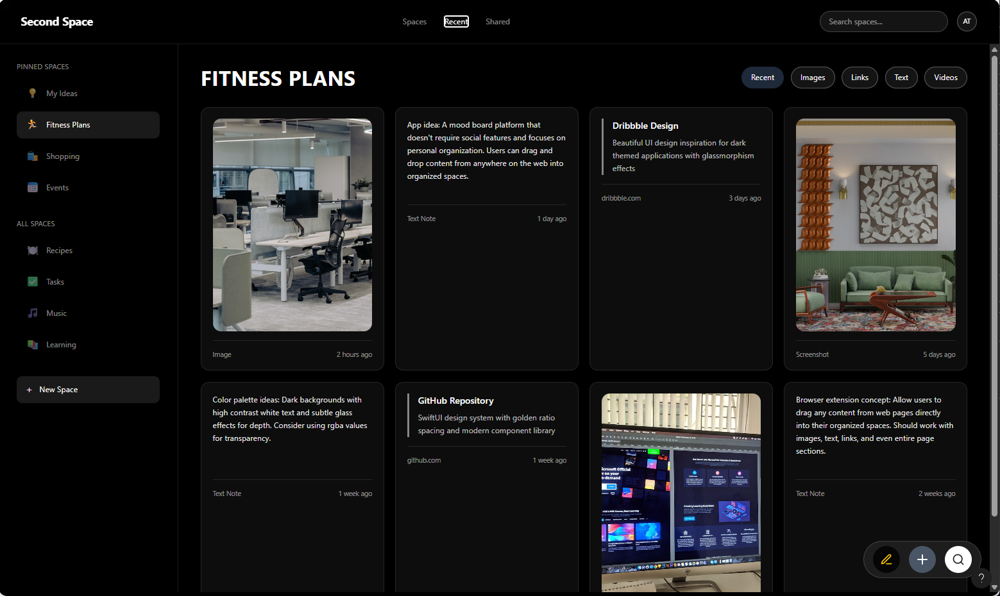
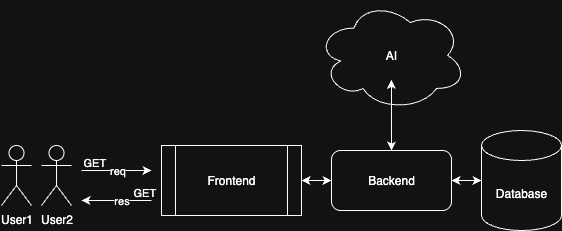

[](https://github.com/cfurley/second-space/actions/workflows/test.yml)
[](https://github.com/cfurley/second-space/actions/workflows/deploy.yml)

<small>CS3203 Group D</small>

# Second Space



## 🎯 What is Second Space?

**Second Space** is an AI-powered hub for creating and organizing visual mood boards and think spaces. Save and curate media from your device or social media profiles in beautiful, customizable spaces.

**🌐 Live App:** https://cfurley.github.io/second-space/

---

## 🚀 Getting Started (5 Minutes!)

### Prerequisites

- **Docker Desktop** installed ([Download here](https://www.docker.com/products/docker-desktop))
- **Node.js and npm** installed ([Download here](https://nodejs.org/)) - Required for running tests and local development
- **Git** installed ([Download here](https://git-scm.com/downloads))
- That's it! No other setup needed.

### Start Developing

```bash
# 1. Clone the repository
git clone https://github.com/cfurley/second-space.git
cd second-space

# 2. Start the full application
docker-compose up --build

# 3. Open your browser
# Frontend: http://localhost
# Backend API: http://localhost:8080
```

**Done!** The entire stack (frontend, backend, database) is running on your machine. ✅

<br>

**Having issues?** Check the [🆘 Need Help?](#-need-help) section below for troubleshooting.

**Want to run tests?** See the [🧪 Testing](#-testing) section for instructions.

---

## 🤝 How to Contribute

### 1. Create Your Feature Branch

```bash
git checkout -b feature/your-feature-name
```

### 2. Make Your Changes

Edit any files you want. The app will reload automatically with your changes!

### 3. Test Locally

```bash
# Make sure everything works
docker-compose up --build

# Visit http://localhost to test
```

### 4. Push Your Branch

```bash
git add .
git commit -m "Add your feature description"
git push origin feature/your-feature-name
```

### 5. Open a Pull Request

1. Go to GitHub - you'll see a yellow banner to create a PR
2. Click "Compare & pull request"
3. Describe what you changed
4. Submit for review

### 6. Automated Review Process

- ✅ **Automated tests** run on your PR
- 👥 **Team member reviews** your code
- 🎉 **Auto-deploys** to production when merged to main

---

## ✨ Feature Roadmap

### Current Features

- 🔐 User authentication (signup/login)

### Coming Soon

- 📦 **Space creation and management** - Create and manage user spaces
- 🎨 **Theme customization** - Choose from various themes
- 📱 **Media organization** - Import and organize media such as PNG, MP4, GIFs
- 🤖 **AI Integration** - Help scrape and organize media automatically
- 👥 **Collaboration** - Share and work on spaces with others in real-time
- ⏰ **Time Capsule** - See what you did a year ago
- 🎭 **Customization** - Profile pictures, custom themes, bitmoji integration
- 🎉 **Special Events** - Limited edition themes and features

---

## 🏗️ Project Architecture




| Layer            | Technology                                    |
| ---------------- | --------------------------------------------- |
| Frontend         | React, TypeScript, Vite, Tailwind CSS         |
| Backend          | Node.js, Express.js                           |
| Database         | PostgreSQL 16                                 |
| Deployment       | GitHub Pages (frontend), Render.com (backend) |
| CI/CD            | GitHub Actions                                |
| Containerization | Docker Compose                                |

---

## 🧪 Testing

### Running Tests

```bash
# Run all frontend tests
cd frontend
npm install
npm test

# Run all backend tests
cd backend
npm install
npm test

# Run a specific test file
npm test login.test.tsx
```

### Where Tests Live

Tests are in `__tests__` folders:

- `frontend/src/components/__tests__/`
- `frontend/src/utils/__tests__/`
- `backend/src/controllers/__tests__/`
- `backend/src/services/__tests__/`
- `backend/src/models/__tests__/`

---

## 🆘 Need Help?

### Common Issues

**Docker won't start?**

```bash
docker-compose down -v
docker-compose up --build
```

**Frontend not loading?**

```bash
# Check if containers are running
docker-compose ps

# View logs
docker-compose logs -f frontend
docker-compose logs -f backend
```

**Database connection error?**

```bash
# Wait 10 seconds after starting for DB to be ready
docker-compose logs database | grep "ready to accept connections"
```

### Contact

- Open an issue on GitHub
- Ask in team chat

---

<hr>

<small>
    Group D<br>
    CS3203<br>
    © 2025, Second Space<br>
</small>
