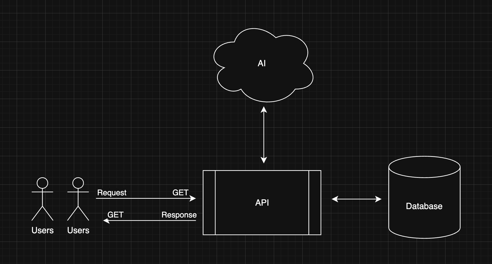
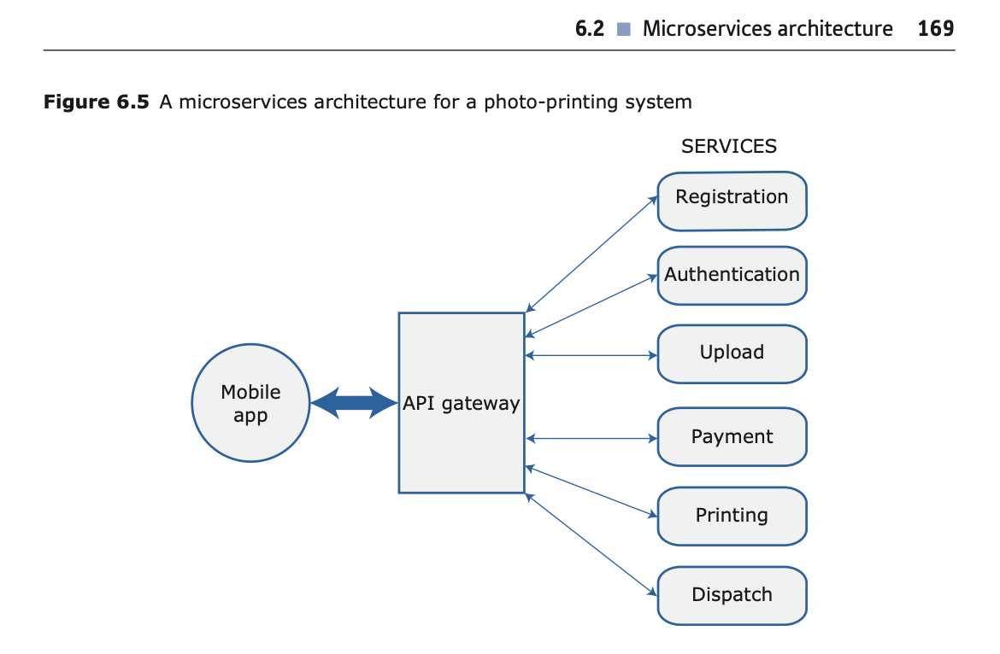

CS3203 Group D

# Second Space

## Summary

This is the repository for <b>Second Space</b>, an AI Integrated Hub for saving and creating think/mood boards with media from the users device or social media profiles. **Feel free to expand upon this summary.

## Project Architecture
  
Single Server Architecture: Diagram 1

  
Multi Service Architecture: Diagram 2 (from textbook)

### AI

This is the main feature of the software product. <b>Second Space AI</b> could help to build the <b>Spaces</b> where users can collect their media too. <b>Second Space AI</b> could also gather media from other websites or google images for the users. think of the search for media thats built into modern powerpoint. **Again Feel Free To Edit This.

### Frontend

This is the frontend of the second space application. I copied over the demo that LightTurtle made. Use the command -> <b>"npm i; npm run dev;"</b> to run the program. (You must have nodejs and npm installed.)

The frontend of the application is what the users will interact with, this can be the <b>web application</b>, or even the <b>mobile application.</b> For web, frameworks lite VueJS or React can be used. For mobile there is Swift, and Java im pretty sure for Android.

### API

This is the communication hub for the application. This can be built in either <b>PHP</b> or <b>NodeJS</b>. This should ideally be stateless, and be used for handling POST and GET requests, and interacting with the database on a seperate port than the frontend for security.

<b>The API</b> can either have <b>processes within the server itself</b>, as shown in the <b>first architecture diagram</b>, or can be a <b>multi-service or micro-service</b> application with <b>processes being handled on their own containers</b> which can be disconnected, or updated on with patches to that specific system.

<b>The type of processes</b> that either the api-server or microservices would handle are:  <b>{authentication, registration, upload, download, payment, printing, dispatch, erorr logging}</b>

### Database

This is the database for the second space application. This can either be a <b>MySQL</b>, <b>Postgres</b>, or <b>MongoDB</b> database. 

<b>SQL Databases are very good for structured data</b>. Things like user accounts or purchases with ACID practices. For unstructured data that is changing, for example: images; gifs; videos; whacky text files; anything really.. <b>NoSQL databases such as MongoDB would be very good.</b> They can easily be setup with a docker container and a volume which can actually just be used on any virtual machine. <b>The data is more flexible</b> as its in <b>JSON</b> format and is literally <b>variable->value pairs for objects.</b>

### Resources
This directory is the place to store resources for the website such as <b>images</b> or <b>icons</b>. Currently it contains one of the stock images Riley had in the presentation, as well as the flow charts for different application architectures.

## Editing Code & Branching
Please push code to the <b>dev</b> branch, that way main is our stable application branch.

## Testing
We can try to use testing through github, or write our own test. Im not very familiar with this process..

## Anything Else Please Add!
Im serious, add to this readme! 
Images are easy to put in, just add the image to resources then in the document where you want to use it just type:  
'< img src='./resources/$YOU_IMAGE_NAME' width='300'>'
 
If we all put our mind to it we can build something cool, that is actually functional, and hopefully find a way to incorporate AI, that might need to be someone job tbh.